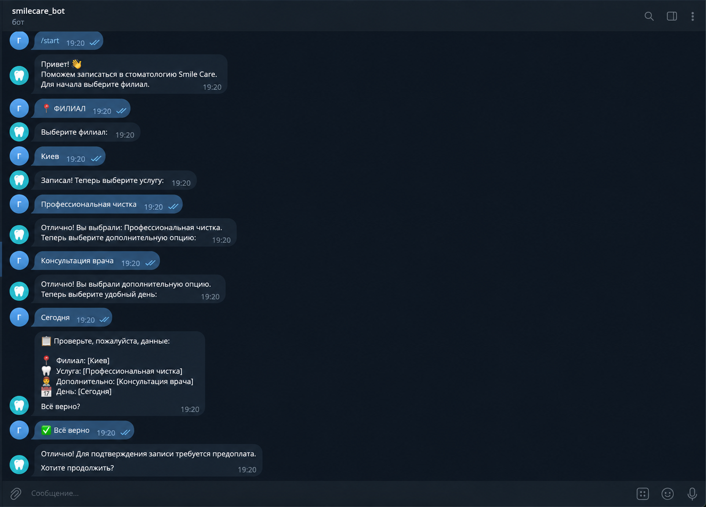

# AI Lead Qualification Telegram Bot

A no-code business automation project built with **Make.com, Telegram Bot API, Make Data Store, and an experimental OpenAI fallback** to capture incoming leads, guide them through a qualification flow, store structured information, and hand qualified leads over to a manager.

The project was created as a practical automation demo focused on reliable lead handling, multi-step conversational logic, structured data collection, validation, and human handoff.

## What the Workflow Does

- Receives incoming messages from Telegram
- Guides users through city, service, extras, and preferred date selection
- Collects lead information step by step
- Stores conversation state and structured lead data in Make Data Store
- Routes users through different paths using routers, filters, and conditional logic
- Handles custom city input and other state-dependent user input
- Validates input in multi-step flows
- Shows a final lead summary before confirmation
- Supports prepayment confirmation logic
- Sends qualified lead information to a manager
- Supports human handoff after qualification
- Includes an OpenAI fallback route that was tested for free-text messages

## My Role

I designed, built, tested, and iterated on the automation workflow, including:

- Conversation flow and state design
- Make.com routers, filters, and conditional branches
- Lead data collection and qualification logic
- Telegram Bot interaction flow
- Make Data Store state management
- Input validation and fallback handling
- OpenAI integration and testing
- Manager notifications and human handoff
- Debugging routing/filter issues and edge cases
- Reworking parts of the architecture after testing

## Tools & Technologies

- **Make.com** — workflow automation, routers, filters, conditions, and scenario logic
- **Telegram Bot API** — user communication and bot interaction
- **Make Data Store** — state management and structured lead data
- **OpenAI** — experimental fallback for free-text messages
- **Webhooks / event-driven logic**
- **Conditional routing and input validation**

## Workflow Architecture

```text
Telegram User
    ↓
Telegram Bot
    ↓
Make.com
    ↓
Routers & Filters
    ↓
State Management + Structured Data Collection
    ↓
Qualification Flow
    ↓
Review & Confirmation
    ↓
Prepayment Step
    ↓
Manager Notification + Human Handoff

Optional / fallback path:
Free-text message → OpenAI → Telegram response
```

## Example User Flow

```text
/start
  ↓
Choose / enter city
  ↓
Choose service
  ↓
Choose extras
  ↓
Choose date / time
  ↓
Review collected information
  ↓
Confirm details
  ↓
Prepayment confirmation
  ↓
Manager handoff
```

## Why the Main Flow Is Deterministic

An important part of this project was deciding **where AI was actually useful**.

I initially tested OpenAI as a broader free-text conversational layer. During testing, I found that the core qualification steps — collecting required fields, validating selections, preserving state, and producing a reliable handoff — benefited more from deterministic state-based logic than from generative responses.

For that reason, the production-style qualification flow uses explicit states, filters, and validation. OpenAI remains an experimental fallback rather than being responsible for critical business logic.

If I rebuilt the project today, I would keep this separation: deterministic logic for required business steps and LLMs only where natural-language understanding adds measurable value.

## Key Features

- Multi-step lead qualification
- Structured lead data collection
- State-based conversation logic
- Automated routing
- Input validation
- Custom user-input handling
- Lead summary before final confirmation
- Prepayment confirmation
- Manager notifications
- Human handoff
- Experimental LLM fallback

## Project Goal

The goal was to automate the first stage of customer communication so a business can:

- respond to leads consistently
- collect required information automatically
- reduce repetitive manual communication
- keep lead data structured
- pass a qualified prospect to a manager with useful context

## What I Learned

This project gave me practical experience with:

- designing multi-step automation workflows
- working with structured data and state management
- debugging conditional branches and filters
- testing LLM integration instead of assuming AI is always the best solution
- validating user input
- handling edge cases in conversational flows
- separating deterministic business logic from generative AI
- combining automation with human handoff
- iterating on architecture based on test results

## Screenshots

### Telegram Bot Demo — Dental Clinic Use Case

A client-facing example of how the qualification workflow can be adapted for a service business: branch selection, service choice, additional option, preferred day, final data review, and prepayment confirmation.



### AI & Routing Logic

This closer view shows the central **Router**, **OpenAI**, **Telegram Bot**, and **Make Data Store** modules inside the automation. OpenAI is used as a fallback/experimental path; the critical qualification flow is state-based.


### Full Workflow Overview

The full scenario view shows the automation and the conditional routes used to support the multi-step lead qualification flow.


## Security

API keys, bot tokens, webhook secrets, private credentials, and real customer data are **not included** in this public repository.

## Status

The core qualification workflow is functional and tested: structured data collection, state handling, routing, confirmation, prepayment logic, and manager handoff. The OpenAI free-text route is experimental and is not used for critical qualification steps.
